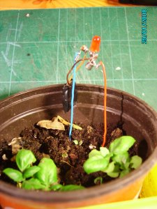

הרעיון צמח מאטב נייר שעיקמתי בצורת בן אדם, שאז תקעתי באחד העציצים שבמרפסת. רציתי שזה יגיד לי מתי להשקות את העציצים. העיקרון שמאחורי הרעיון הזה הוא מעבר חשמל במים - ככל שיש פחות מים באדמה ההתנגדות גבוהה יותר. עשיתי קצת מחקר על התנגדות חשמלית באדמה, עד שהגעתי לערך הנגד המתאים. הגאדג'ט בנוי מבטריית כפתור, טרנזיסטור, שני נגדים ולד, מה שהופך אותו למאוד זול.  
  

  
  

אני מאוד גאה ברעיון הזה. [הוא הופיע בבלוג של MAKE](http://blog.makezine.com/archive/2008/02/lowtech_plant_watering_in.html) וכתבו עליו [תגובות טובות בכמה אתרים](http://www.google.com/search?hl=en&site=search%26site%3Dsearch%26q%253Dhttp%3A%252F%252Fnurne.blogspot.com%252F2008%252F01%252Fwater-me-man.html%26q%3Dhttp%3A%252F%252Fnurne.blogspot.com%252F2008%252F01%252Fwater-me-man.html&q=http%3A%2F%2Fnurne.blogspot.com%2F2008%2F01%2Fwater-me-man.html).
