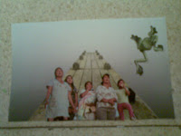
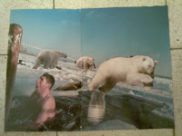

 ערימת גליונות של National Geographic מטיילת בחדר שלי, ועלתה השאלה מה לעשות איתם - לשמור לדורות הבאים (שמבחינתם דוב הקוטב יהיה היסטוריה) או לזרוק. אופציה יצירתית שחשבתי עליה היא לעשות מהם קולאז'ים - סוג של תרפיה באמנות ומיחזור. התיישבתי על הרצפה הקרירה עם מספריים ודבק, והתחלתי ליצור.
