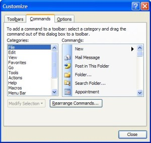
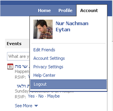
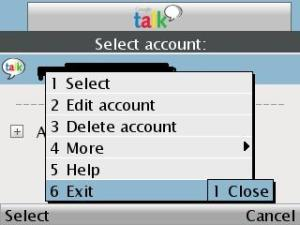
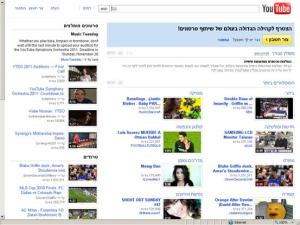
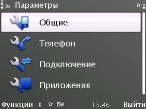

Do Nested Menus have to be Nasty Menus

  

  

Did you know that your user is aware of only HALF of your app's functions? Did you know that he regularly uses only 10% of them? So why did you invest so much time and money in the remaining part?

  

In this post, I will give some guidelines on how to design nested menus for your advantage, so that your user gets the most out of your app.

  

First of all, we need to clarify the expression "nested menus". A nested menu is simply a set of functions (a menu) that is extended (nests) from a function in another menu. Nested menus can have a few layers, what I will refer to as "Depth".

  

It's like a bag. In some of the pockets you just throw things in. One pocket is for your wallet that has more pockets in it. In another pocket a woman may put a make-up bag that contains even more boxes.

  

A designer must choose the correct depth of nested menus on the scale of Deep and Flat. How many steps should it take to do X? And Y? How many clicks? Your user counts every mouseClick and mouseMove he makes. If your competition gives the same function for less clicks - you lost a user.

  

Know your user

Is your user a novice or advanced? Allow your new users to learn the functions: "I know what I want, but I'm not sure how to get it". Use tooltips to guide your user. Show your user how to become faster, by offering him key shortcuts.

Allow your advanced users to go ahead and run: "I know what I want, and I already know how to get it". Use keyboard shortcuts (control+key combinations).

  

Exercise: How do you copy the full contents of a text doc and paste it into a new doc? I believe you already have an efficient mental model of the actions you need to perform. Now, perform the same task using another technique. Try using another HID (Human Interface Device: mouse, keyboard)

  

App learning:

Microsoft Office programs allow you to choose which toolbars to show on the main window (Text, Paint, Paragraph, Help…). The user can simply drag and drop menus, dock them wherever, and edit the controls in each chunk of functions. It is recommended to use an event tracking system that calculates the top functions of your app.

Turning a scientific calculator off is not done by just pushing the OFF button. You need to press Shift + OFF. It's a means of data-loss-prevention.  
  
Additional example for data-loss-prevention: When you exit from MS Word, a message box pops up, asking if you want to save the file before you leave.  
  
Don't nest it!  
Nokia IM app uses this technique, but too deeply. In order to exit, you need to press about 9 clicks. One of the nested menus breaks the following rule: If you have only one function, don't nest it.  
  
  
They ANTI-nested the language settings: they simply put it on the bottom of their front page.  
  
In conclusion, there are many options of designing nested menus. Some options are better for the user experience. A designer working on a UI with nested menus must take these rules and guidelines into account.
