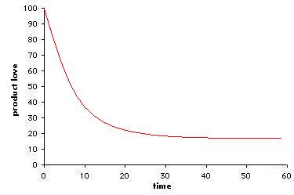
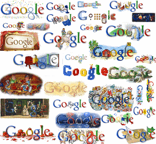
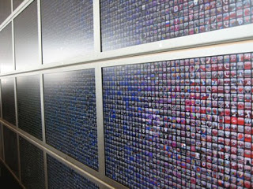

I saw someone let his friend ride his Segway for the first time. Once he got his moves together, he had a huge smile on his face. When the owner of the Segway rode it, he didn't have a smile that big.

  

  

It seems like the first time you use a good product is like a crush. It's like falling in love. It's an euphoric time period in which everything about the product is perfect:

\- In the shop, the shoe fits perfectly.

\- Your new smartphone is the smartest on the first few months.

\- The first bites are tastier.

  

  

How can you turn a Crush into real Love towards your product? **Renovate.**

When the Crush has faded from a lo-tech product (like a chair), you renovate by buying a new model.

In contrast, in an online product, you have the luxury of renovating **Content** **& Design**.

  

Active/Passive renovation in Content & Design:

Q: How come billions of searchers don't get bored from the good-ol'-Google search engine?

A: Because Google renovates.

How?

1\. Design: Google posts Doodles - artful variations of their logo on the homepage. A designer's effort = massive renovation ("Did you see today's Google Doodle?"). This is an active renovation method, meaning Google did it themselves.

2\. Content: Today's Google search yields different results than yesterday's Google search. **The product is alive**. The source of Google's content is the whole World Wide Web, thus it is renovated passively.

  

  

Q: How come millions of users don't get bored from the good-ol'-iPhone?

A: Because Apple renovates.

How?

1\. Design: iPhone 4. (active renovation).

2\. Content: hundreds of thousands of applications, created by external developers (passive renovation).

  

  

Same goes to Twitter, Facebook, and etc...

  

An interesting case is MySpace, which "Passivized" both Content _and_ Design renovation, by letting users create skins and temaplates (Design) for their profiles (Content).

  

Same goes to Blogger, WordPress and etc..

  

Another interesting case is the way Facebook and Twitter are releasing their new current designs. They don't just _set_ the new design. Instead, the user has to _install_ the new design, extending his feeling of renovation ("I installed the new Facebook profile").

  

  

A line goes through these examples: **Passive Content Renovation**. These companies got their users to input data for them, and then they sell it to other users. That's amazing.

  

Compared to that, a newspaper is all based on active renovation. The writers renovate the content, and the designers renovate the design.

  

Q: How do you know that the crush phase is over?

A: Numbers: if statistics show that users abandon the product (low rate of returning users), prepare a massive renovation (preferably design) and let everybody know about it.

Media: Expect that media coverage will bring a lot of users to your product. 30 days later - issue a major update. ([http://gettingreal.37signals.com/ch15\_One\_Month\_Tuneup.php](http://gettingreal.37signals.com/ch15_One_Month_Tuneup.php))

Rumors: if the word in the street is that your product is boring, renovate and set a fact: "our product is now renovated".

  

In conclusion, in order to keep your users' love to the product, renovate your product's Content & Design. Let your users renovate for you, by providing them a platform.
