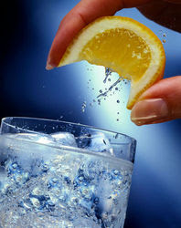
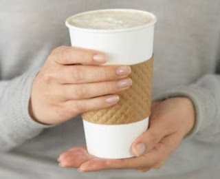

Your user read all about you and your competition. He contacted you before he decides to go for it and buy.

  

He doesn't want to hear the general info your website says all over again. What will drive him to buy is further info that specifically suits him. The _fast, easy and fun_ way to sell is using **Buzz Words Injections**.

  

Your user knows all the buzz words:

_Location Based Apps, Mobile, Free, Fast, Responsive, Beautiful, Business, Push, Fun, Tasty, Synchronized, Cheap, Economic, Designed, Classic, Well-Built, Communicate, Developer API, Easy to Use,_ and etc...

  

Your job is so easy: **inject the customer with customized buzz words!**

  

Your customer is a business man? (Well, he's dressed like one.)

Think of his life story. He loves his job and is committed to it, and he also maintains his personal life in his daily routine.

**So, what buzzwords do you inject?**

Cheap? Economic? Hell no!

You inject Business, Synchronized, Mobile and Communicate.

When he hears these words, he will expand them in his mind and create a fantastic story surrounding the product.

  

Your customer is a senior citizen? Inject Economic, Reliable and Easy to Use.

  

Young tech geek? Free, Apps, and Developer API would do the magic.

  

Turtle-neck and designer glasses? Inject Designed, Classic, and Well-built.

  

**Listen to your conceptions and intuitions**, because they're probably right. Each industry has its own buzzwords, so go ahead and **make a list of buzzwords related to your product**.

  

  

**Tactile buzzwords** give a sense of touch:

_"Glass covered", "Single sheet of metal"_ are **compact words that expand to a deep touch-related feeling in the listener's body and brain**. After hearing these words he HAS to touch the product. And once he puts his hands on it, he will never leave.

  

_"Classic"_ - is a **holistic word in the phonetic sense**. It works your larynx, tongue, makes you exhale slowly, hold 'Sss' in the tip of your teeth. It's maybe somatic, but this is the way it works. It's like food. It's tasty! And thus **creates desire**.

  

I love tasty buzzwords.

  

  

Google name their Android versions after desserts for a reason. Android gives you **the sweet User Experience of a handheld Donut, a Froyo or an Eclair**.

  

[BlackBerry is a fine example of using this kind of Phonetic Sugar to make users love the product.](http://www.fastcompany.com/magazine/151/made-to-stick-the-quest-forthe-perfect-name.html) The name connects to the neurons in your brain that handle Fun and Prestige.

  

  

Coffee is on us

A study shows that your chances in a job interview increase if the interviewer holds a hot beverage. **Give your potential customer a warm feeling of a cup of coffee.** You can inject that with a real cup of coffee, or with words that create a warm feeling. If your company treats customers like family, let him feel that.

  

**Inject _ME._**

People like hearing their name. First thing you do is ask their name and use it. _"Hi Tom, it's nice to meet you, Tom. My name is Nur..." + a firm handshake + look in the eye._ My inbox is full of newsletters. I get to those that have my name in the title faster than those that are general. It's personal. They injected ME in it. _"Nur, this week's XYZ newsletter..."_

  

The next time a customer contacts you, **try injecting him custom-tailored buzzwords.** If you take it, "he'll take it".
