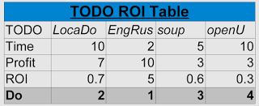

Congratulations!

You started implementing the [TODO,DOING,DONE](http://www.nurne.com/2011/02/todo-doing-done.html) method for being productive ‏like a machine. You set lists of super-TODOs, mini-TODOs and micro-TODOs, but now you don't know which of the micro-TODOs you should do first.

  

There's a small and fast technique I created that I call TODO ROI Table. You sort your TODOs according to their ROI.

  

How is this done?

1. List all your **TODOs** (super, mini or micro)
2. List **time**\* to complete each TODO
3. Estimate the **profit**\* gained from completing each TODO
4. Calculate the **ROI** of each TODO. ROI = (profit/time)
5. **Sort TODOs by ROI**: 1st TODO is the highest ROI.

_\* whatever unit, just keep it uniform throughout the table._

_Time: minutes, hours, days.._

_Profit: $, happiness, pats on the back.._

  

  

**Start DOING the TODOs, one by one, until you're DONE!**
