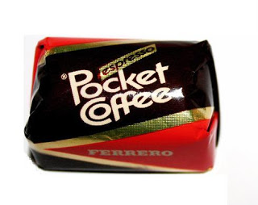
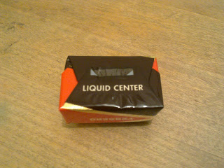

How to Predict your User's UI Questions

  

While using your product, your users will have questions that reflect **uncertainties in the UI**. Some of these questions should be answered before they are even asked.

  

_‎"What will happen if I click this?"_

_‎"How do I know if it really saved my data?"_

_‎"Did he delete it or not?"_

_‎"Do I need to click this once or twice?"_

_‎"What happens if I accidentally exit?"_

and etc...

  

  

I found a wonderful solution in the **Ferrero Pocket Coffee,** a chocolate praline, filled with Espresso cream.

  

People eat pralines like this: bite one half, look at the filling, and bite the other half. The user asks "Can I bite the Ferrero Pocket Coffee in half, like I'm used to do with pralines?" Ferrero **answered a question before it was asked, clearly and boldly:** They wrote **"Liquid Center"** in the bottom of the wrapper. Bite in half at your own risk. You may ruin your shirt by spilling espresso cream all over it. They **answer the user in the critical point** - when he starts unwrapping the praline.

  

  

**So how do we deal with Liquid Centers in the UI?** How do we answer our users' questions before they are asked?

  

First step is **scouting for Liquid Centers**. Collect questions by trying the product yourself, while being verbosely critical and naive. Write down every question that rises. Don't worry about the answers yet. (If you're too protective of your product, let your Mother try it and listen to her feedback).

  

There's no mathematical scheme for finding Liquid Centers, but here are some guidelines:

Consider 3 points:

**Before:** User is at point A. What's his next move?

**During:** User found point B. He's hesitating. Is this for sure where he should be?

**After:** User went past point B and got to C. How does he know that?

  

**e.g. Dan wants to send an email.**

He opens his email app. \[What does he probably want to do?\]

Dan found a "New" button. \[Does it mean "New Email"? "New Account"? "New Meeting"?\]

After clicking it \[Once? Double-click?\],

he gets a New Email Window \[Does the window communicate that?\].

  

Second step after finding the questions is answering them in the most straightforward manner.

The answers can be represented in a Message Box or in a Graphical hint.

A link implies that a website will be opened with a single click.

A button implies that a single click will start a functionality.

A Message box says: "Fetching info from server..."

A graphical icon can differentiate a New Meeting vs a New Email.

and etc..

  

Back to Dan's example, let's deal with some Liquid Centers in the UI:

\[What does he probably want to do?\]

\-> Send an email. So let's make that button visually focused.

\[Does it mean "New Email"? "New Account"? "New Meeting"?\]

\-> "New Email". We put an envelope icon on it.

\[Once? Double-click?\]

\-> Single click, because we set it to look like a graphical push button.

\[does the window communicate that?\]

\-> New Email Window is written in the title.

  

To sum up, you should **find the Liquid Centers of your app, and guide your user through them**. Start by **finding the probable questions**, and finish by **boldly answering them**.
