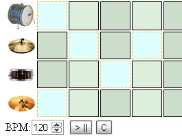

I decided to learn [jQuery](http://jquery.com/), and it's awesome.  
This one is a stay up late project, a Drum Machine built entirely with jQuery and HTML5 audio.  
Check the bars you want to play on the chosen drum's row, set the BPM, hit play and PARTY!!  
  

  

[DrumBox](http://bit.ly/lowMJn)
