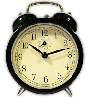

Waking up to a good morning is the basis of a good day and good lifestyle. I am working on my morning routine for starting a wonderful day, and want to share some of my insights with my readers. Some of these tips you may know, and some even implement. So here they are.  
  
Waking up to a good morning is based on sleep. Sleep 8 hours. This will ensure proper freshness throught the day and an alert mind.  
  
Waking up to a good morning begins with your alarm clock. Wake up every day at the same hour. I set [a song by Royksopp](http://www.youtube.com/watch?v=51Bpx63wkbA) as my alarm clock tone in my phone. The song is positive, has high pitch sounds, and has a good beat. These properties make me wake up with a smile, reminds me of birds chirps, and makes me wanna move, respectively.  
  
  

  
  
Don't snooze. Wake up only once. These 5 more minutes of sleep have no real impact on you, other than messing up your waking up mechanism. When the clock rings - wake up and get out of bed!  
  
Next, don't sit. You should immediately do something in your good morning. Enter a good morning routine. I stretch side to side, drink a whole glass of water and immediately brush my teeth. Not to mention the board room of course. During that whole time - stand up! Don't let the sleepiness take over and ruin your good morning.  
  
Coffee. The strong smell in the morning makes your whole system wake up. Don't even get me started on the caffeine.. I spend 5 to 15 minutes every morning making myself 2 cups of coffee from my beloved espresso machine. I grind the beans myself, extract espresso and froth the milk. Believe me, it's better than waiting in line for 5 to 15 minutes in the coffee shop.  
  
  

  

Have Breakfast. You fasted for 8 hours. Your body needs nutrition to start up the day. I prefer something salty, like a piece of bread and cheese. Sweets on the morning give me heart burn during the day, and tend to make me hungry again faster. Additionally, eating something in the morning can create bowel movement and free your belly for a wonderful day!  
  
  
Entertainment. I drink my coffee and have my breakfast while reading tech news. Some read politics. I get stressed and irritated by that. Listen to your mood while reading different kinds of news. I sometimes watch a couple of [cat videos on youtube](http://www.youtube.com/watch?v=IytNBm8WA1c). That always makes me smile and laugh.  
  
Take a shower. Everybody will thank you for that. Your hair will get a nice shape, your skin will be fresh and clean from the night, your whole face will wake up, your eyes will freshen up, and you will smell good. That's also a good time to shave and look sharp.  
  
  

  
  
  
Leave 5 minutes before you HAVE to. Take into consideration that you need to walk to the bus/train/car. And oh man... You forgot your wallet at home! should that dictate being late to a bad day? I hate running to the bus. So I do my best to **wait** for it. As the chefs say: "The sauce should wait for the pasta". Your are the sauce.  
  
What is your morning routine? Do you have extra tips on waking up to a good morning?  
  
  
Good morning and have a wonderful day!
