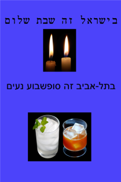
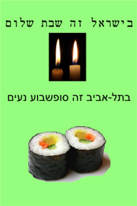

Tel-Aviv, my hometown in Israel, is known as the 24/7 city of fun.

  

Today I saw two Jewish ladies give away pairs of Shabbat candles to women passing by. Some took it with gratitude, and some refused.

  
  
This brought an idea to my mind: What are the "pairs" of Tel-Aviv for Shabbat, rather than candles?  
  
I came up with these posters.  
  
  

תל-אביב, העיר שלי, ידועה כעיר הבילויים 24/7.

  

היום ראיתי שתי נשים דתיות מחלקות זוגות של נרות שבת לנשים שעוברות ברחוב. חלק מהנשים לקחו והודו, וחלק סירבו.

  

זה העלה לי רעיון: מה הם ה"זוגות" התל-אביביים של שבת, יותר מאשר נרות?

  

הפוסטרים האלה הם התוצאה.

  
  

  

Top line: "In Israel it's Shabbat Shalom"

Bottom line: "In Tel-Aviv it's a Nice Weekend"
