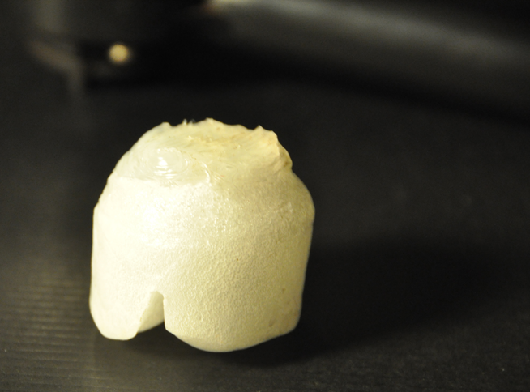

  

בבית קפה, הבריסטה דופק את הקפה הישן מהמכונת קפה בעזרת נוקבוקס. נוקבוקס מקצועי הוא פח עם מוט גומי שעובר בקוטר שלו.

  

רציתי ליצור אחד כזה לעצמי. הקונספט שלי לנוקבוקס עשה-זאת-בעצמך היה שונה מהנוקבוקס המקצועי. רציתי ליצור נוקבוקס שלא לוקח הרבה מקום.

  

החלטתי ליצור מתאם נוקבוקס קטן שיושב על השפה של פח האשפה ומתאים בול לדירה קטנה. יצרתי יציקת פלסטיק ואת הצד העליון שעליו דופקים כיסיתי עם סיליקון לעיטוף. לפלסטיק עשה-זאת-בעצמך, השתמשתי בהוראות מהפוסט שלי לגבי [עבודה עם פלסטיק בבית](http://www.nurne.com/2011/10/working-with-plastics-at-home.html).

  

המתאם נוקבוקס לפח-אשפה עובד מעולה! הוא מאפשר לזרוק קפה ישן בקלות, ומעמעם את הרעש החזק של המכה.

  

מה שלמדתי מהעיצוב ומהיצירה:

המוצר המוגמר היה מלא בבועות אוויר, מה שהפך אותו לשביר, ובמהלך הייבוש הצורה שתכננתי השתנתה קצת. בפעם הבאה אחרי ההמסה של הפלסטיק אני אוציא ממנו את הגז לפני היציקה והייבוש.
