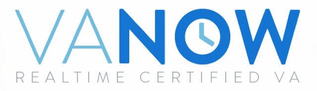

I launched the landing page of VAnow.net - the webapp that sets you you up with a Realtime Certified Virtual Assistant or be one

  

I am currently looking for VAs and clients, gathering emails and checking out the market vefore building the whole system

  

I emailed Rob Walling about VAnow.net and here's his reaction:

_I like it. This is one of the ideas I was going to pursue a while back_

I don't want to sound like a crazy fan, but if the master of Micropreneurship likes it and thought about doing it himself - I'm happy :)

  

Rob also suggested I niche it at entrepreneurs - I think it's a great idea

  

Sign up with your email

Send it to friends

Let me know about places where VAs and entrepreneurs hang out

And if you can think of something that might help - send me a message :)

  

