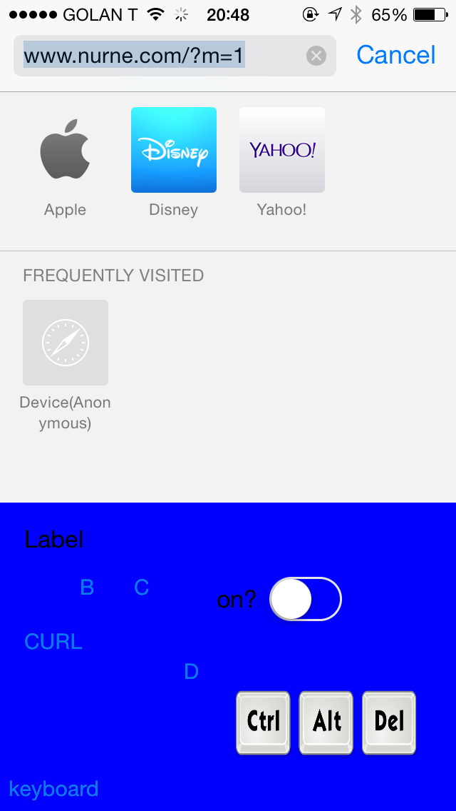

Hi guys  

  

So a few years ago I developed some keyboard for Nokia devices.

They were Symbian and J2ME apps that provided the user more writing languages, since Nokia only gave you 1 or 2 keyboards, even tough the machine had all the fonts and everything.

  

Android devices let developers create 3rd party keyboards for a long time

During WWDC14 , Apple announced the new iOS8 Extensions API, which allows creating Custom Keyboards for the iPhone

  

So I set out to look for a template to create my custom keyboard - but naturally fount nothing, as this was the first day they released the iOS8 and Xcode6 betas

  

Eventually I created my own template for iOS8 custom keyboard

  

You can download it here: [iOS 8 Custom Keyboard Template](https://bitbucket.org/nurnecom/ios8-custom-keyboard-template)  
  
A hideous example I built with it:  
  

  

You can change the xib file to whatever you wish thus creating whatever UI experience you want

  

Share your keyboards!
