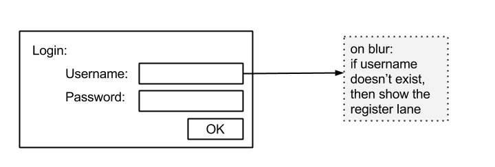

As more iOS 8 beta versions are released, I find myself formatting my iPhone and re-installing many apps I use, and also new apps.  
  
This means a lot of Login and/or Register going on..  
  
Generally speaking,  
Register takes a million data points from the user (n=infinity)  
and Login only takes username and password (n=2)  
  
As I'm typing my credentials on the iPhone keyboard in different services, I find myself struggling with 2 repeating problems in all services:  
  
**Problem 1 : I try to Register, but I'm already registered.**  
The Elegant Solution : The service should find out the user exists as early as possible, and route the user to the login lane.  
  

<table align="center" cellpadding="0" cellspacing="0" class="tr-caption-container" style="margin-left:auto;margin-right:auto;text-align:center;"><tbody><tr><td style="text-align:center;"></td></tr><tr><td class="tr-caption" style="text-align:center;">Existing user tries to register</td></tr></tbody></table>

**Problem 2 : I try to Login, but I'm not yet registered.**  
The Elegant Solution : The service should find out the user doesn't exist as early as possible, and route the user to the Register lane.  

<table align="center" cellpadding="0" cellspacing="0" class="tr-caption-container" style="margin-left:auto;margin-right:auto;text-align:center;"><tbody><tr><td style="text-align:center;"></td></tr><tr><td class="tr-caption" style="text-align:center;">Non-existing user tries to login</td></tr></tbody></table>

  
I would also recommend explaining the situation to the user and asking them whether they want to be routed.  
  
_Note that these solutions expose some security threats that need to be prevented._
