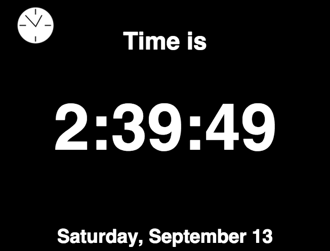
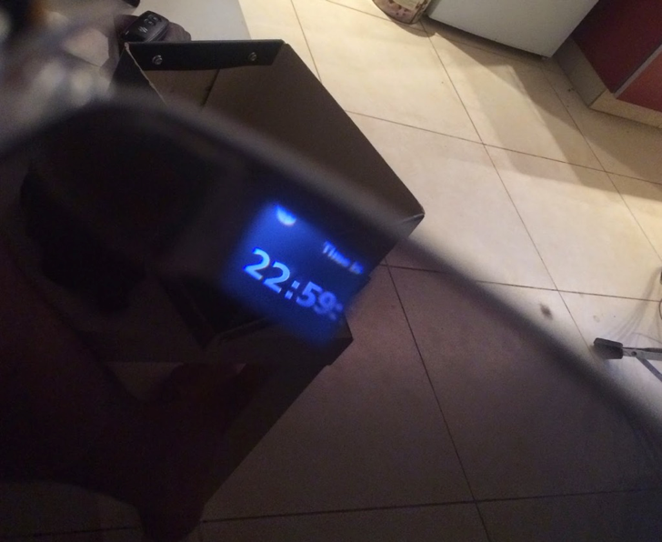

Google Glasses for the People!  
  

I've been working on a Google Glass clone project on-and-off for a few months now  
  

A Raspberry Pi is auto-connect on startup to my iPhone's hotspot, and projects an AirApp to a re-constructed video glasses display

  

AirApps are...  
micro  
web  
PUSH (!!!)  
apps  
with a minimalistic UI/UX  
  

AirApp

  
  

Ingredients:

- Sunglasses frame
- Video Glasses LCD components
- Raspberry Pi
- Tons of hacking, adjustments and nausea

  

a model with a model

  

Biggest challenge: come up with the solution of config'ing the raspberry pi to auto connect to my iPhone's hotspot

  

Funnest challenge: re-engineering the video glasses

  

Most interesting challenge: designing and building the AirApps framework  
  
  

what you see
