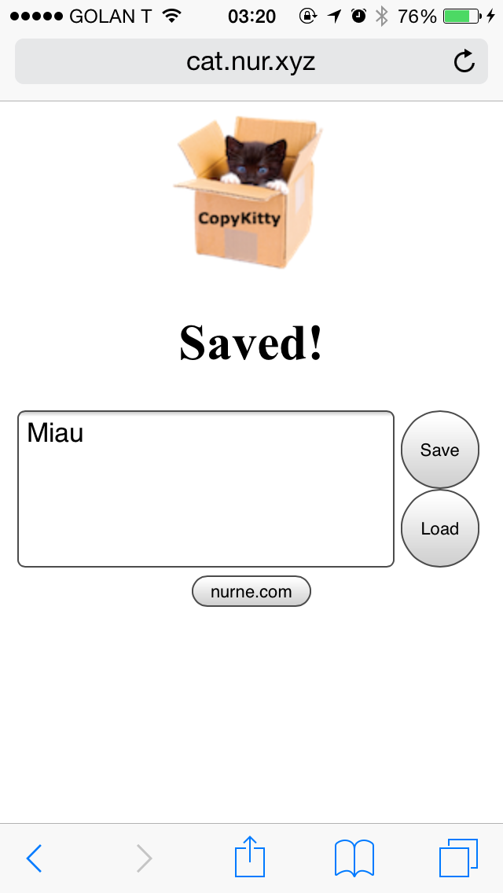

Need to copy a snippet or url or a long phone number?  
You can email it to yourself..  
Or you can use CopyKitty  
  
It's a microfication of Apple's new Handoff system for Macs and iDevices  
  
1\. Goto [http://cat.nur.xyx](http://cat.nur.xyx/)  
2\. You'll get an auto-generated copy kitty url  
If you want to choose your own url - simply replace the auto-genearted hash in the end of the url with your choice of hash (i.e. http://cat.nur.xyz/me)  
3\. in both devices and save/load texts between them as much as you like!  
  
I use it a lot to copy url's from my desktop to my phone  
  
have fun!  
miau  
  

