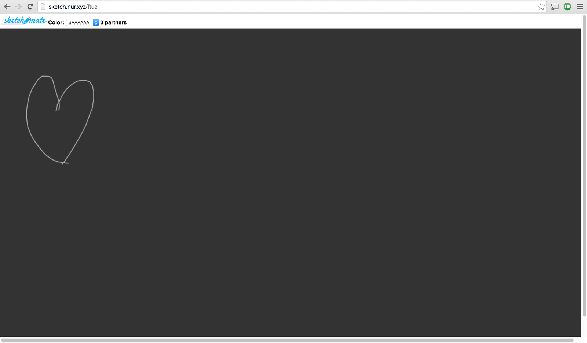
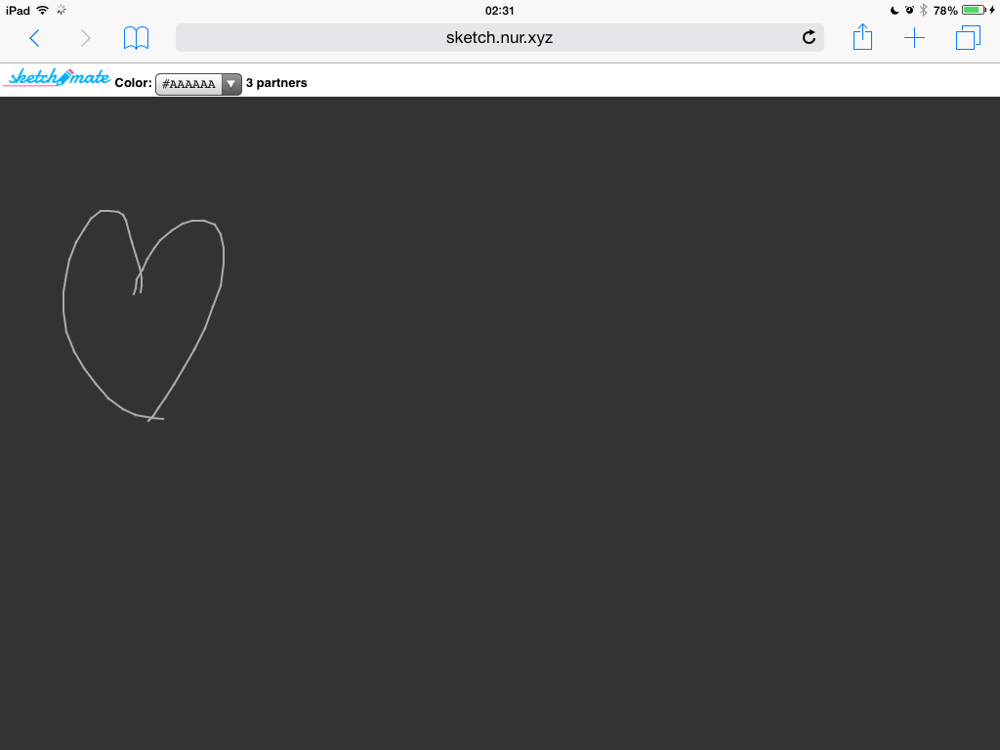
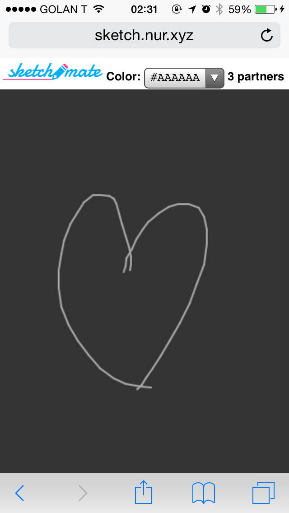

Hello  
  
If you need to sketch in realtime with others remotely on your tablet, phone or whatever:  
[http://sketch.nur.xyz/lobby](http://sketch.nur.xyz/lobby)  
  
To create a new session, just change _lobby_ to the room name you want to create or to join  
(i.e. sketch.nur.xyz/brainstorming1)  
  
I wish to KISS, but do let me know of additional features you want  
  
  

desktop

  
  

ipad

  

iphone

  
PS it's extra fun with chromecast!
