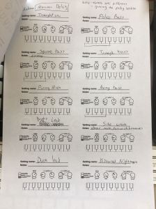
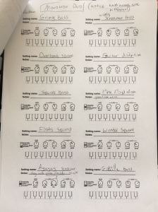

Do you have a Korg Monotron, Duo or Delay?  
Korg say that they don't like presets for these little synths, to make you explore more rather than take a ready-made preset.  
With that said, if you wanna start from somewhere familiar and then tweak it - you want presets.  
  
So I created a small preset bank that you can program easily  
  
Here they are (in my hand writing):  
  

<table align="center" cellpadding="0" cellspacing="0" class="tr-caption-container" style="margin-left:auto;margin-right:auto;text-align:center;"><tbody><tr><td style="text-align:center;"></td></tr><tr><td class="tr-caption" style="text-align:center;">Korg Monotron - presets</td></tr></tbody></table>

  
  
I hope you find these Korg Monotron Presets useful !!!
